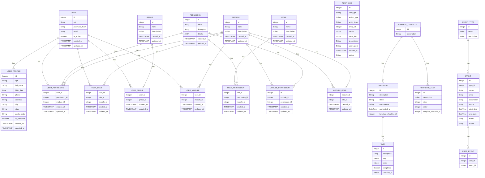

# Obsidian-Notations

### Teste

```mermaid
erDiagram
    USER {
        Integer id
        String cpf
        String password_hash
        String email
        Boolean is_active
        TIMESTAMP created_at
        TIMESTAMP updated_at
    }
    USER_PROFILE {
        Integer id
        String cpf
        String full_name
        Date birth_date
        String phone
        String address
        String city
        String state
        String postal_code
        Boolean is_complete
        TIMESTAMP created_at
        TIMESTAMP updated_at
    }
    USER_PERMISSION {
        Integer user_id
        Integer permission_id
        Integer module_id
        TIMESTAMP created_at
        TIMESTAMP updated_at
    }
    USER_ROLE {
        Integer user_id
        Integer role_id
        Integer module_id
        TIMESTAMP created_at
        TIMESTAMP updated_at
    }
    USER_GROUP {
        Integer user_id
        Integer group_id
        TIMESTAMP created_at
        TIMESTAMP updated_at
    }
    USER_MODULE {
        Integer user_id
        Integer module_id
        TIMESTAMP created_at
        TIMESTAMP updated_at
    }
    ROLE {
        Integer id
        String name
        String description
        TIMESTAMP created_at
        TIMESTAMP updated_at
    }
    ROLE_PERMISSION {
        Integer role_id
        Integer permission_id
        Integer module_id
        TIMESTAMP created_at
        TIMESTAMP updated_at
    }
    MODULE {
        Integer id
        String name
        String description
        TIMESTAMP created_at
        TIMESTAMP updated_at
    }
    MODULE_PERMISSION {
        Integer id
        Integer module_id
        Integer permission_id
        TIMESTAMP created_at
        TIMESTAMP updated_at
    }
    MODULE_ROLE {
        Integer module_id
        Integer role_id
        TIMESTAMP created_at
        TIMESTAMP updated_at
    }
    PERMISSION {
        Integer id
        String name
        String description
        JSON details
        TIMESTAMP created_at
        TIMESTAMP updated_at
    }
    GROUP {
        Integer id
        String name
        String description
        TIMESTAMP created_at
        TIMESTAMP updated_at
    }
    AUDIT_LOG {
        Integer id
        String user_cpf
        String action_type
        String entity_type
        Integer entity_id
        JSON details
        JSON meta_info
        String ip_address
        String user_agent
        TIMESTAMP created_at
        String status
    }
    CHECKLIST {
        Integer id
        String description
        String status
        String competence
        DateTime completed_at
        Integer template_checklist_id
    }
    TASK {
        Integer id
        String description
        Integer step
        Integer order
        Boolean completed
        Integer checklist_id
    }
    TEMPLATE_CHECKLIST {
        Integer id
        String description
    }
    TEMPLATE_TASK {
        Integer id
        String description
        Integer step
        Integer order
        Integer template_checklist_id
    }
    EVENT {
        Integer id
        Integer type_id
        String name
        String area
        String description
        String status
        DateTime start_date
        DateTime end_date
        String forms
        String author
    }
    EVENT_TYPE {
        Integer id
        String name
        String description
    }
    USER_EVENT {
        Integer id
        Integer user_id
        Integer event_id
    }

    USER ||--o{ USER_PROFILE : "has"
    USER ||--o{ USER_PERMISSION : "has"
    USER ||--o{ USER_ROLE : "has"
    USER ||--o{ USER_GROUP : "has"
    USER ||--o{ USER_MODULE : "has"
    ROLE ||--o{ ROLE_PERMISSION : "has"
    MODULE ||--o{ MODULE_PERMISSION : "has"
    MODULE ||--o{ MODULE_ROLE : "has"
    PERMISSION ||--o{ ROLE_PERMISSION : "has"
    PERMISSION ||--o{ USER_PERMISSION : "has"
    PERMISSION ||--o{ MODULE_PERMISSION : "has"
    GROUP ||--o{ USER_GROUP : "has"
    MODULE ||--o{ USER_ROLE : "has"
    MODULE ||--o{ USER_PERMISSION : "has"
    MODULE ||--o{ USER_MODULE : "has"
    MODULE ||--o{ MODULE_ROLE : "has"
    CHECKLIST ||--o{ TASK : "has"
    TEMPLATE_CHECKLIST ||--o{ TEMPLATE_TASK : "has"
    TEMPLATE_CHECKLIST ||--o{ CHECKLIST : "has"
    EVENT_TYPE ||--o{ EVENT : "has"
    EVENT ||--o{ USER_EVENT : "has"
```
